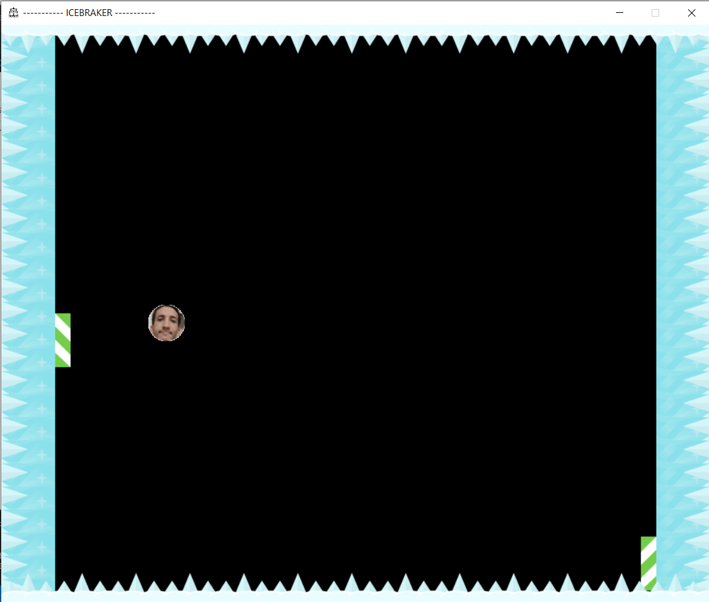
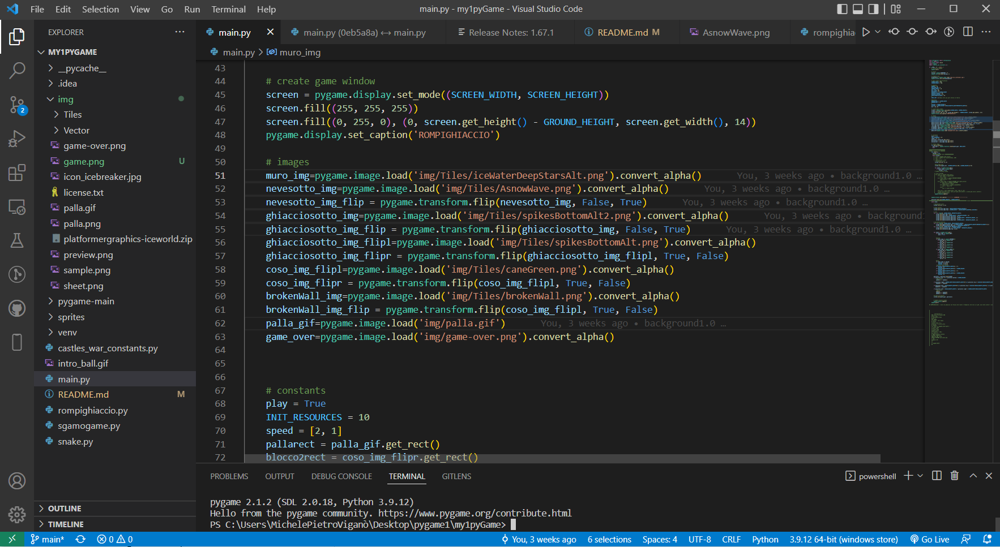

# my1pyGame

---

<!-- my1pyGame-->

  

  
  

  
  

I know it's a stupid game, but it's also my first time with python.

<h3>
Idea
</h3>

Basically, I wanted to learn how to use the pygame library and python itself for game development.

`<b>`In fact this game was developed with the [Pygame](https://www.pygame.org/news) library.

### Requirements

* [Python3](https://www.python.org/downloads/)
* [Pygame](https://www.pygame.org/news)

### Features

- Cool for playing with strangers and breaking the ice

<h3 align="center">
:: Workflow ::
</h3>

### Find Me on :

  
  

